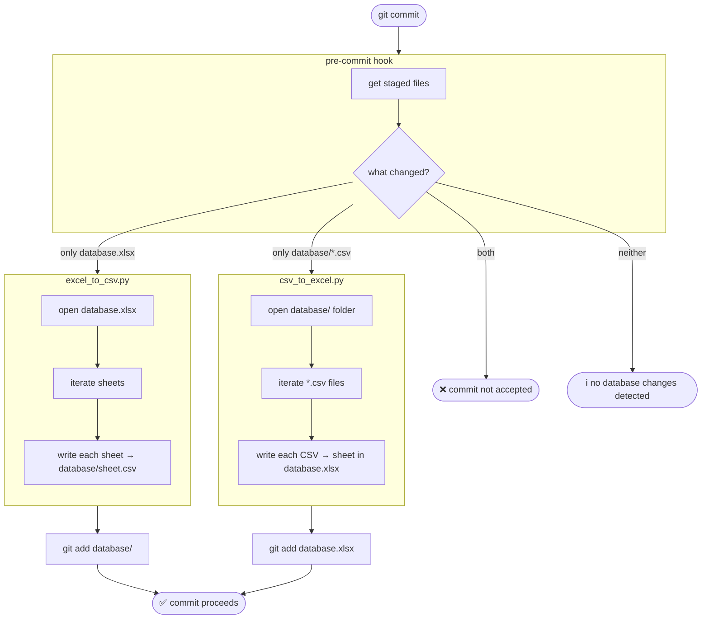

```mermaid
flowchart TD
    START([git commit]) --> HOOK

    subgraph HOOK[pre-commit hook]
        GET[get staged files] --> CHECK{what changed?}
    end

    CHECK -- both --> BLOCK([❌ commit not accepted])

    CHECK -- only database.xlsx --> E2C

    subgraph E2C[excel_to_csv.py]
        direction TB
        E1[open database.xlsx]
        E2[iterate sheets]
        E3[write each sheet → database/sheet.csv]
        E1 --> E2 --> E3
    end

    E2C --> ADD_CSV[git add database/]
    ADD_CSV --> DONE

    CHECK -- only database/*.csv --> C2E

    subgraph C2E[csv_to_excel.py]
        direction TB
        C1[open database/ folder]
        C2[iterate *.csv files]
        C3[write each CSV → sheet in database.xlsx]
        C1 --> C2 --> C3
    end

    C2E --> ADD_XL[git add database.xlsx]
    ADD_XL --> DONE

    CHECK -- neither --> NO_CHANGE([ℹ️ no database changes detected])

    DONE([✅ commit proceeds])
```
