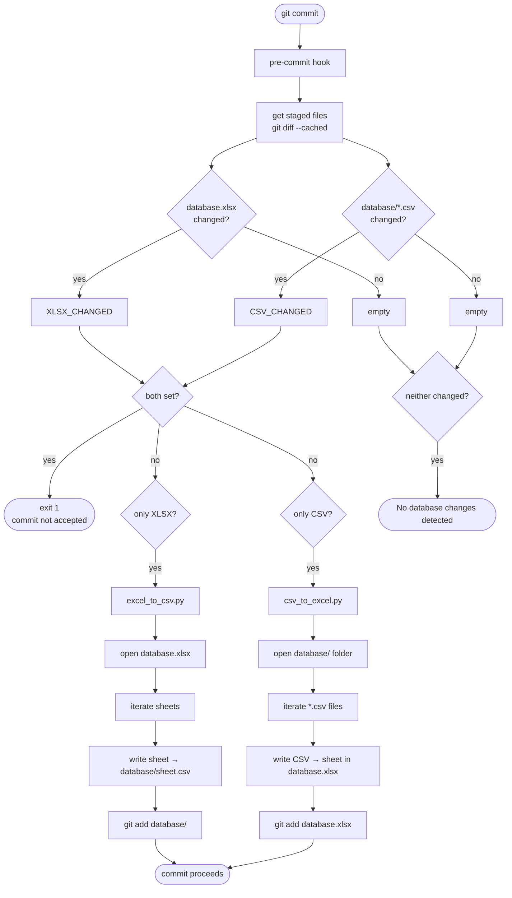

```mermaid
flowchart TD
    A([git commit]) --> B[pre-commit hook]

    B --> C[get staged files\ngit diff --cached]
    C --> D{database.xlsx\nchanged?}
    C --> E{database/*.csv\nchanged?}

    D -- yes --> F[XLSX_CHANGED]
    D -- no --> G[empty]
    E -- yes --> H[CSV_CHANGED]
    E -- no --> I[empty]

    F & H --> J{both set?}
    J -- yes --> K([exit 1\ncommit not accepted])

    J -- no --> L{only XLSX?}
    L -- yes --> M[excel_to_csv.py]
    M --> M1[open database.xlsx]
    M1 --> M2[iterate sheets]
    M2 --> M3[write sheet → database/sheet.csv]
    M3 --> M4[git add database/]
    M4 --> Z

    J -- no --> N{only CSV?}
    N -- yes --> O[csv_to_excel.py]
    O --> O1[open database/ folder]
    O1 --> O2[iterate *.csv files]
    O2 --> O3[write CSV → sheet in database.xlsx]
    O3 --> O4[git add database.xlsx]
    O4 --> Z

    G & I --> P{neither changed?}
    P -- yes --> Q([No database changes detected])

    Z([commit proceeds])
```
